# Study AI Platform - Database Schema Diagram

## Overview

This document provides visual representations of the database schema for all services in the Study AI Platform.

## 1. Complete Database Architecture

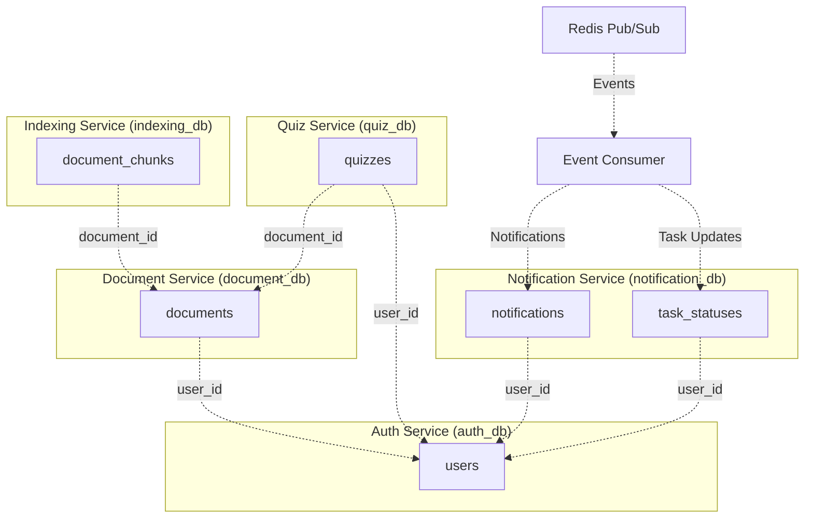

## 2. Auth Service Schema

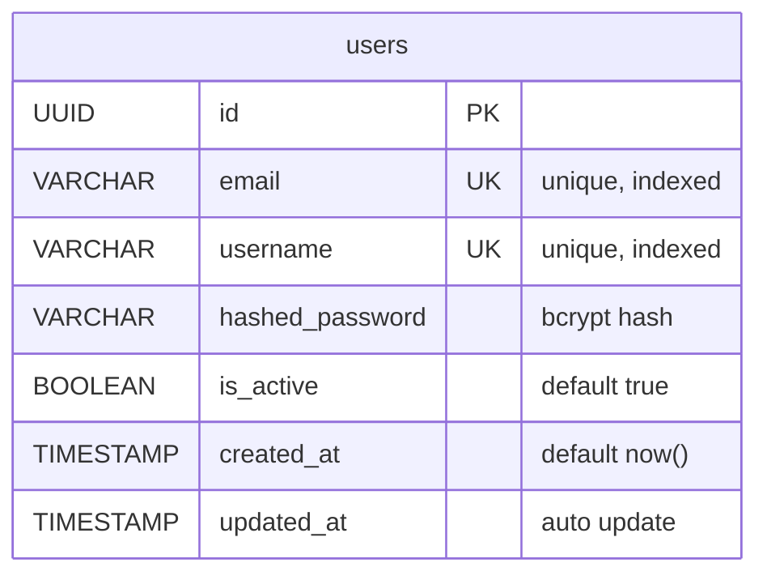

## 3. Document Service Schema

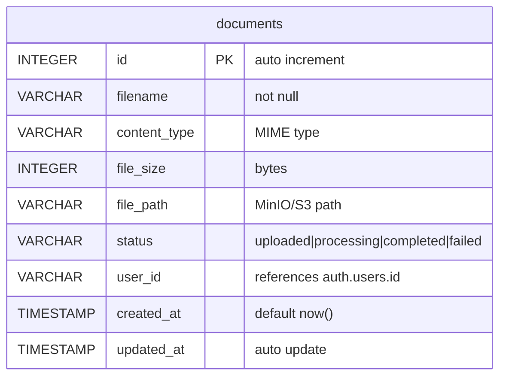

## 4. Indexing Service Schema

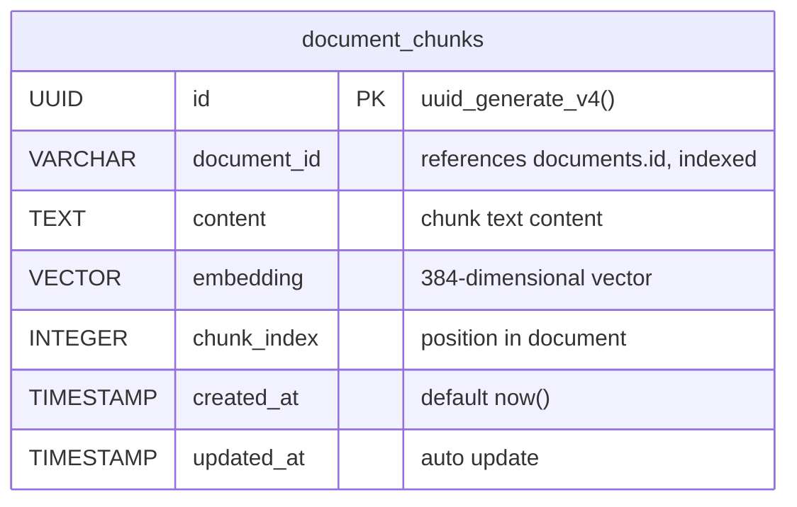

## 5. Quiz Service Schema

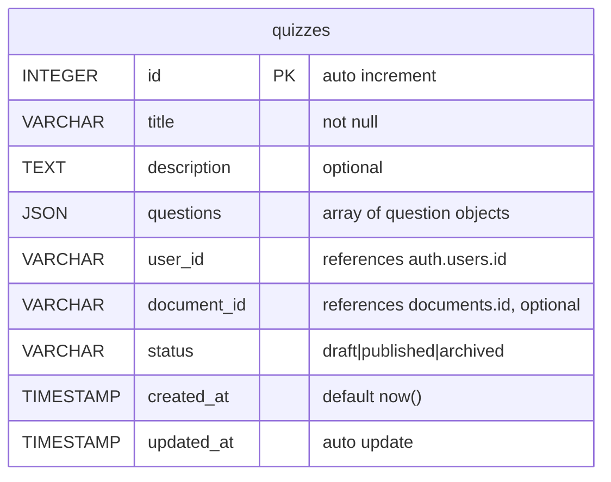

## 6. Notification Service Schema

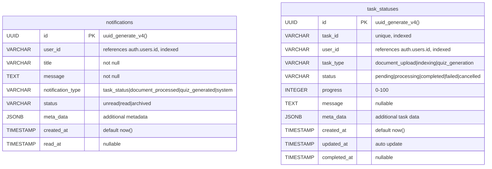

## 7. Data Flow Diagram

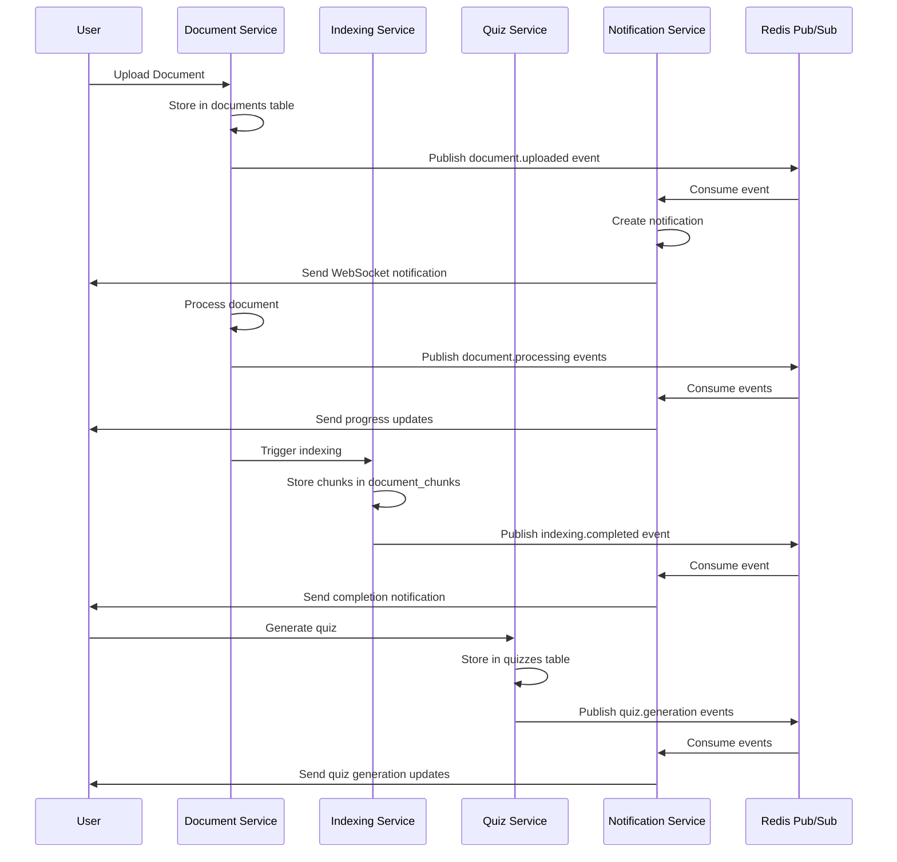

## 8. Event-Driven Architecture

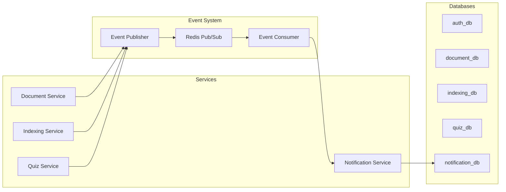

## 9. Index Strategy

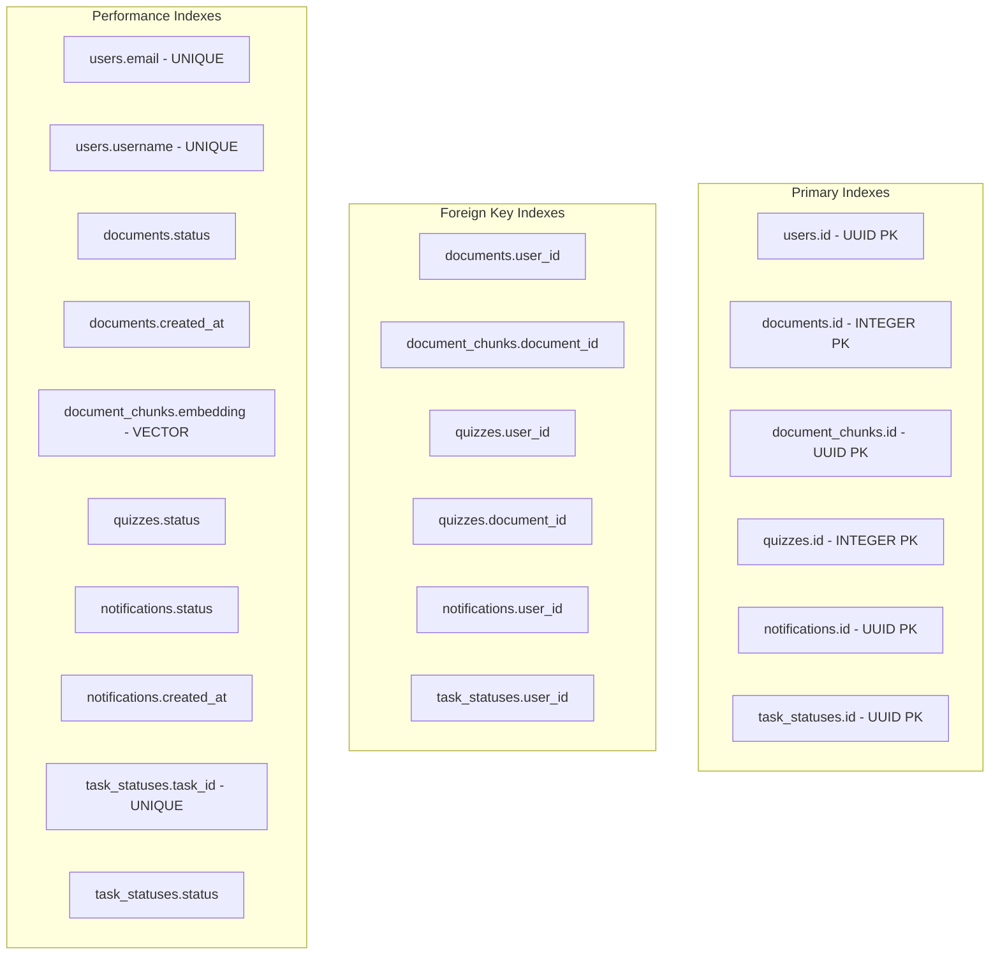

## 10. Database Relationships Summary

| Service | Table | Primary Key | Foreign Keys | Key Indexes |
|---------|-------|-------------|--------------|-------------|
| Auth | users | UUID | - | email, username |
| Document | documents | INTEGER | user_id | user_id, status, created_at |
| Indexing | document_chunks | UUID | document_id | document_id, embedding |
| Quiz | quizzes | INTEGER | user_id, document_id | user_id, document_id, status |
| Notification | notifications | UUID | user_id | user_id, status, created_at |
| Notification | task_statuses | UUID | user_id | task_id, user_id, status |

## 11. Vector Search Architecture

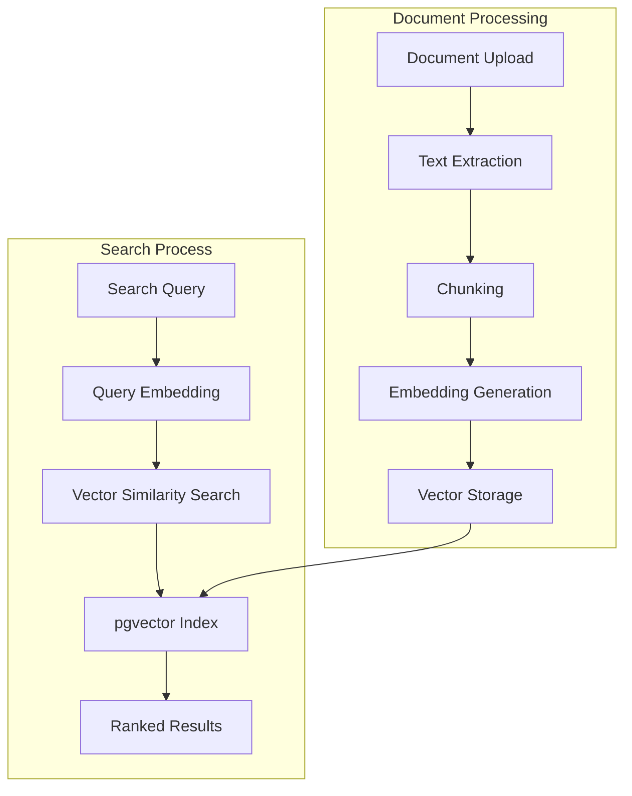

## 12. Notification Flow

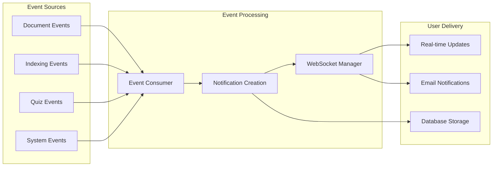

This visual representation helps understand the complete database architecture and relationships in the Study AI Platform. 